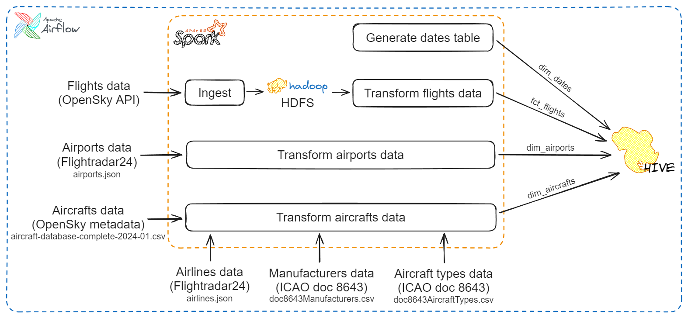
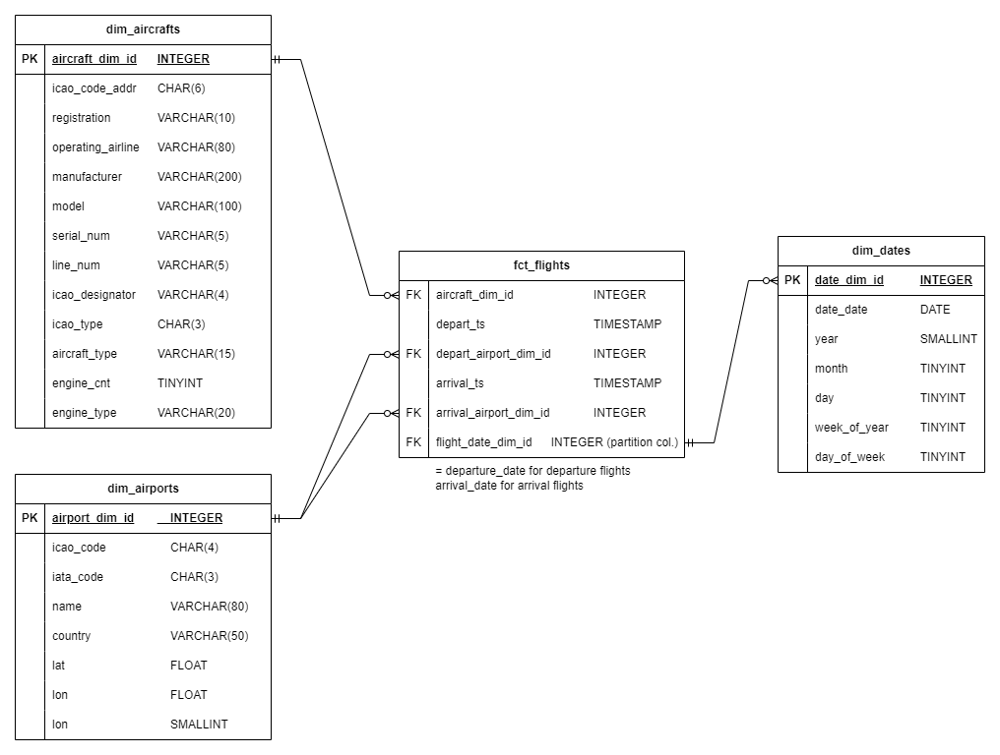

# etl-opensky

## 1. About this project

This project aims to create an ETL pipeline that runs daily to gather historical data about flights into & out of an airport into the data warehouse, from which business users can query and do further analysis.

- This project will work with flights data at [Frankfurt Airport](https://en.wikipedia.org/wiki/Frankfurt_Airport). You should be able to change the airport in the settings (more on that later).


## 2. Technologies used

- **Apache Airflow** for data orchestration.
- **Apache Spark** for data transformation and query processing.
- **Apache Hadoop's HDFS** as the project's distributed file system.
- **Apache Hive** as the data warehousing tool.

## 3. Additional information

### 3.1. Data flow



- Data sources:
    - Flights data: from [OpenSky API](https://openskynetwork.github.io/opensky-api/rest.html), extracted daily.
    - Aircrafts, aircraft types & manufacturers data: from [OpenSky Metadata directory](https://opensky-network.org/datasets/metadata/), downloaded as local files.
    - Airports & airlines data: from FlightRadar24 ([airports](https://www.flightradar24.com/_json/airports.php), [airlines](https://www.flightradar24.com/_json/airlines.php)), saved as local files.
    
> [!note] 
> For simplicity, dimension data is extracted **only once** and saved as `.csv`, `.json` files. Therefore, the data will not be up to date in the future. In real-life cases, there should be CDC systems that can detect changes in dimension data.

### 3.2. Airflow DAG


- `create_hive_tbls` task create Hive tables in the data warehouse.
- `upload_from_local` upload files from local to HDFS. If one of the files already exists in HDFS, its corresponding task is skipped.
- Once `create_hive_tbls` and `upload_from_local` were skipped/ executed successfully, `load_dim_tbls` starts to load dimension tables to Hive data warehouse.
- `extract_flights` task extracts daily flight data from OpenSky API and ingest to HDFS.
- After `load_dim_tbls` and `extract_flights` have executed successfully, `load_fct_flights` load transformed flights data into Hive warehouse.
- Map tasks to the above data flow:
    - Ingest: `extract_flights`.
    - Generate dates table: `load_dim_tbls.dates`.
    - Transform airports data: `upload_from_local.airports` $\rightarrow$ `load_dim_tbls.airports`.
    - Transform aircrafts data: `upload_from_local.{aircrafts,aircraft_types,airlines,manufacturers}` $\rightarrow$ `load_dim_tbls.aircrafts`.
    - Transform flights data: `load_fct_flights`.


### 3.3. Data warehouse schema



## 4. Installation

### 4.1. Set up

1. Clone this repository and navigate to project directory:

```bash
git clone https://github.com/minkminkk/etl-opensky
cd etl-opensky
```

2. Run initial setup scripts through `Makefile`:

```bash
make setup
```

User will be required to enter password. This is for modifying read/write permissions for containers to bind mount directories. 

3. Build/get necessary images and start containers:

```bash
make up
```

After the containers have successfully started, the system is ready to use.

### 4.2. Tear down

After you are done and want to delete all containers:

```bash
make down
```

## 5. Getting started

### 5.1. Interfaces

- Airflow web UI: `localhost:8080`.
- Spark master web UI: `localhost:8081`.
- HDFS web UI: `localhost:9870`.
- Hiveserver web UI: `localhost:10002`.

### 5.2. Schedule DAGs

- Browser-based: Via the Airflow web UI using your browser.
- Command line-based:
```bash
make airflow_shell
```

> [!warning]
> The OpenSky API will mostly errors out when we tries to retrieve data near current time. Therefore you should only run pipelines **about 2 months earlier** than current date.

### 5.3. Query pipeline output in Data Warehouse

- Via Hive's command line `beeline`:
```bash
make beeline
```

The `Makefile` also connects to the existing database. After connected, it is ready to write queries using HQL.

## 6. Configuration

### Target airport for pipeline

- The target airport for flight data extraction is currently Frankfurt airport (ICAO code `EDDF`).
- If you want to change, modify environment variable `AIRFLOW_VAR_AIRPORT_ICAO` with the ICAO code of your desired airport.
    - At runtime: create new variable `airport_icao` in Airflow Web UI.
    - At container creation: in `containers/airflow/airflow.env`.

## 7. Things to improve

- Improve data modeling for data warehouse: So that data can be more effectively queried.
- Configure HDFS to persist data between runs.
- Implement CDC for dimension data.
- Configure cluster to save Spark logs.